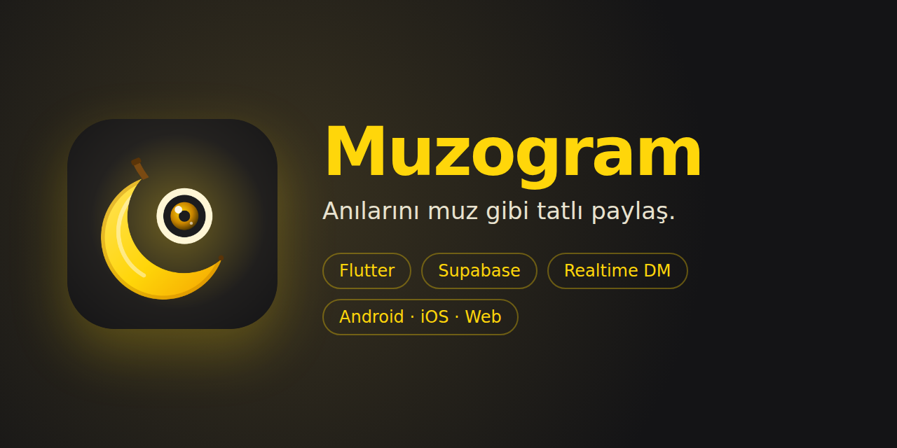
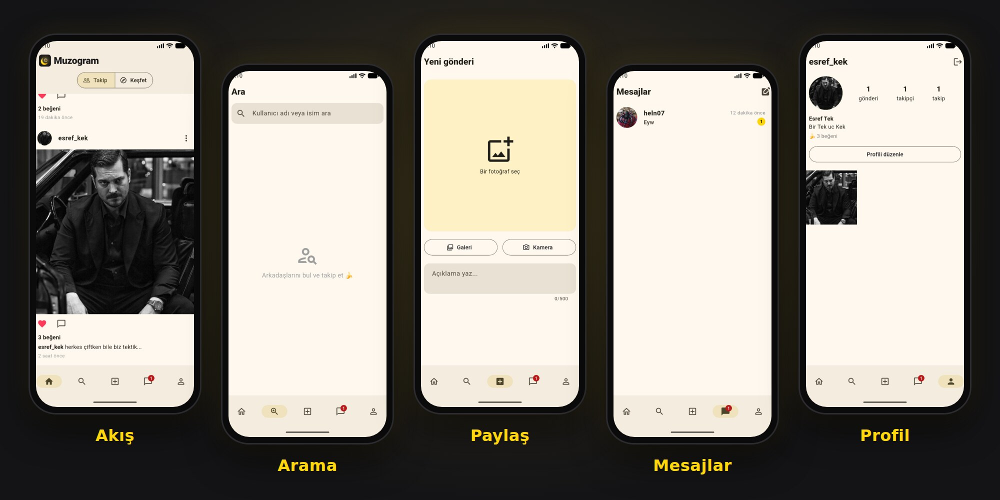

<p align="center">
  
</p>

<p align="center">
  
  
  
  
  
</p>

**Muzogram**, fotoğraf paylaşıp arkadaşlarınla takipleşebildiğin ve gerçek zamanlı mesajlaşabildiğin bir sosyal medya uygulaması. Tek bir Flutter kod tabanından **Android**, **iOS** ve **web** için derleniyor.

> **Neden v2?** İlk Muzogram'ı 2022'de üniversitedeyken Kotlin ve Firebase ile yazmıştım ([Muzo](https://github.com/MustafaAkcicek/Muzo)). v2, aynı fikrin modern teknolojilerle sıfırdan, çok daha kapsamlı olarak yeniden yazılmış hâli.

<p align="center">
  
</p>

## ✨ Özellikler

| | |
|---|---|
| 📸 **Fotoğraf paylaşımı** | Galeriden veya kameradan, açıklamayla birlikte |
| ❤️ **Beğeni ve yorum** | Çift dokunuşla kalp animasyonu, yorum yazma ve silme |
| 👥 **Takip sistemi** | Takip et / takipten çık, takipçi ve takip edilen listeleri |
| 🧭 **Takip & Keşfet akışı** | Sadece takip ettiklerin ya da herkesin gönderileri |
| 💬 **Direkt mesajlar** | Gerçek zamanlı sohbet, okunmamış rozeti, okundu bilgisi (✓✓) |
| 🔍 **Kullanıcı arama** | Kullanıcı adı veya isme göre anında arama |
| 👤 **Profil** | Profil fotoğrafı, biyografi, gönderi ızgarası |
| 🌗 **Açık / koyu tema** | Telefonun temasına otomatik uyum |

## 🛠 Teknolojiler ve mimari

- **Flutter & Dart**: tek kod tabanıyla üç platform
- **Supabase Auth**: e-posta ile kayıt ve giriş
- **PostgreSQL**: `profiles`, `posts`, `likes`, `comments`, `follows`, `messages` tabloları, ilişkiler ve tetikleyiciler
- **Row Level Security**: herkes sadece kendi verisini değiştirebilir, mesajları sadece gönderen ve alan görebilir
- **Supabase Storage**: fotoğraf ve profil resimleri, kullanıcı başına klasör izolasyonu
- **Supabase Realtime**: sayfa yenilemeden canlı mesajlaşma ve bildirim rozeti
- **Web (PWA)**: iPhone'da "Ana Ekrana Ekle" ile uygulama gibi kullanım

```
lib/
├── models/      Post, Comment, Profile, Message, Conversation
├── services/    Veritabanı, depolama ve realtime işlemleri (tek API katmanı)
├── screens/     Giriş, kayıt, akış, arama, paylaş, mesajlar, sohbet, profil
└── widgets/     Gönderi kartı, avatar, logo, kullanıcı satırı
```

## 🔒 Erişim

Muzogram şu an davetle kullanılan kapalı bir uygulama ve kaynak kodu özel bir depoda tutuluyor. Uygulamayı denemek ya da kodu incelemek isteyen işverenler ve geliştiriciler [LinkedIn](https://www.linkedin.com/in/mustafaakcicek) üzerinden bana ulaşabilir.

## 👨‍💻 Geliştirici

**Mustafa Akçiçek** · [LinkedIn](https://www.linkedin.com/in/mustafaakcicek) · [GitHub](https://github.com/MustafaAkcicek)

<sub>© 2026 Mustafa Akçiçek. Tüm hakları saklıdır.</sub>
